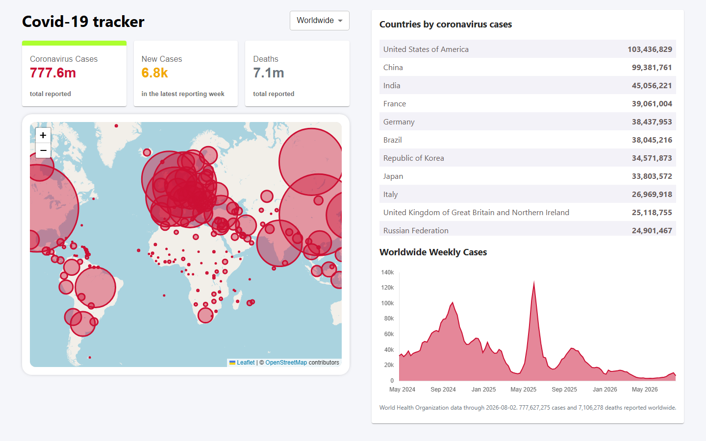

# Covid-19 Tracker App

A COVID-19 dashboard built with React and [Vite](https://vite.dev), showing
[World Health Organization](https://data.who.int/dashboards/covid19/data) figures.

- Total cases, newly reported cases and deaths as clickable tabs
- Worldwide totals plus per-country breakdowns
- Interactive Leaflet map with per-country circles scaled and coloured by the selected metric
- 120-week trend chart of newly reported cases and deaths — hover for exact figures

Deployed live at https://covid19-tracker-c92c2.web.app/



## Getting started

Requires Node 20.19+ or 22.12+ (Vite 7).

```bash
npm install
npm run dev
```

The app runs at http://localhost:5173.

## Scripts

| Script | What it does |
| --- | --- |
| `npm run dev` | Start the dev server with hot module replacement |
| `npm run build` | Production build into `build/` |
| `npm run build:data` | Regenerate the WHO data snapshot |
| `npm run preview` | Serve the production build locally |
| `npm test` | Run the Vitest unit suite once |
| `npm run test:watch` | Run unit tests in watch mode |
| `npm run test:coverage` | Unit tests with coverage, enforcing the 85% thresholds |
| `npm run test:e2e` | Playwright end-to-end tests against the production build |
| `npm run test:all` | Coverage run followed by the end-to-end suite |
| `npm run lint` | Lint with ESLint |

The end-to-end suite builds the app and serves it before running, and needs the
browser binaries once:

```bash
npx playwright install chromium
```

## Project layout

```
index.html            Vite entry point
vite.config.js        Build + Vitest config
scripts/
  build-data.mjs      Generates the data snapshot from WHO figures
public/data/
  covid-snapshot.json Committed snapshot the app loads at runtime
playwright.config.js  End-to-end config; builds and serves before testing
e2e/
  tracker.spec.js     Browser tests against the production build
  fixtures.js         Stubbed disease.sh responses, so runs are deterministic
src/
  main.jsx            React root (createRoot)
  App.jsx             All application state and layout
  api.js              Loads the snapshot — throws on non-2xx, supports AbortSignal
  util.js             Metric definitions and pure helpers: sorting, formatting, radii
  components/
    InfoBox.jsx       Selectable stat card (keyboard accessible)
    Map.jsx           Leaflet map, circles and popups
    Table.jsx         Country table sorted by total cases
    LineGraph.jsx     Chart.js trend chart
    ErrorBoundary.jsx Keeps a panel crash from blanking the page
  __tests__/          Vitest + Testing Library specs
```

## Testing

Two layers:

- **Unit and component** (Vitest + Testing Library) covers the helpers, the API
  client and every component, with a regression test for each bug listed in the
  changelog. CI enforces 85% coverage; the suite currently sits at 99.6%
  statements.
- **End-to-end** (Playwright) drives the real production bundle in Chromium,
  because jsdom cannot prove that Leaflet paints, that Chart.js reaches a
  canvas, or that the lazy chunks load. API calls and map tiles are stubbed from
  `e2e/fixtures.js` so runs never depend on a third-party service.

Specs that touch no DOM declare `@vitest-environment node`; jsdom costs roughly
five seconds per file to construct, so this keeps the suite near 20 seconds.

## Deployment

The build output goes to `build/`, which is what `firebase.json` serves:

```bash
npm run build
firebase deploy
```

## Where the data comes from

Figures come from the **World Health Organization**, regenerated by
`npm run build:data` into `public/data/covid-snapshot.json` (about 40KB) which
the app loads as a single same-origin request.

The build step exists because, as of 2026, no public COVID API is at once
accurate, reachable from a browser, and small:

| Source | Current? | CORS? | Practical in a browser? |
| --- | --- | --- | --- |
| disease.sh | No — frozen at 2023-03-09 | Yes | Yes, but the figures are wrong |
| WHO | Yes | **No** — preflight returns 403 | No, 26MB CSV |
| Our World in Data | Yes | Yes | No, 17MB with no server-side filtering |

`disease.sh` looks live — its `updated` timestamp is always current — but its
upstreams stopped publishing: JHU CSSE archived on 10 March 2023 and Worldometers
went quiet. Its own endpoints now disagree with each other by roughly 28 million
cases, and it under-counts the WHO total by about 74 million.

Running the aggregation on a build machine sidesteps both CORS and file size.
A scheduled workflow re-runs it weekly and commits the result only when the
figures actually change.

Two consequences worth knowing:

- **WHO publishes no recovery figures**, so the original "Recovered" tab has no
  source. It is replaced by newly reported cases, which is the only genuinely
  current signal in the data.
- **WHO reports weekly, not daily**, and only around 80 countries still report
  new cases at all. Cumulative totals cover 225 countries; recent activity is
  much sparser. That is the state of global COVID reporting, not a gap in the app.

Country coordinates and flags still come from `disease.sh`, which carries no
case figures — borders do not go stale the way counts do.
