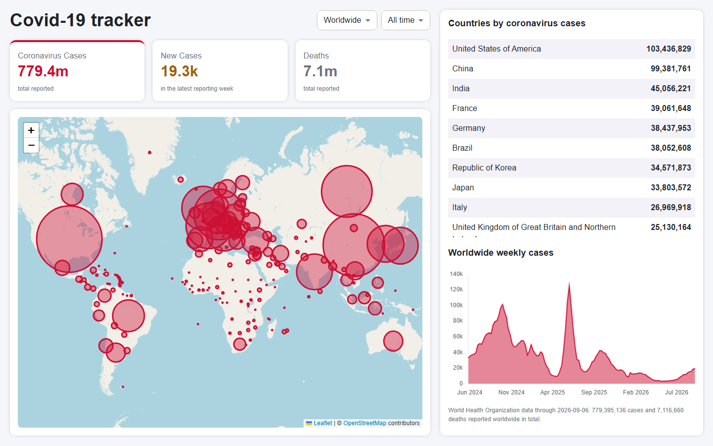

# Covid-19 Tracker App

A COVID-19 dashboard built with React and [Vite](https://vite.dev), showing
[World Health Organization](https://data.who.int/dashboards/covid19/data) figures.

- Total cases, newly reported cases and deaths as clickable tabs
- Worldwide totals plus per-country breakdowns
- Interactive Leaflet map with per-country circles scaled and coloured by the selected metric
- 120-week trend chart of newly reported cases and deaths, worldwide or for the
  selected country — hover for exact figures
- Date filter: all time, the last 4 weeks, 3 months, 6 months or year, or any
  custom run of reporting weeks. The cards, table, map and chart all follow it,
  and the period is kept in the URL so a filtered view can be bookmarked or shared

Deployed live at https://covid19-tracker-c92c2.web.app/



## Getting started

Requires Node 22.12+ (Node 20 reached end of life in April 2026).

```bash
npm install
npm run dev
```

The app runs at http://localhost:5173.

## Scripts

| Script | What it does |
| --- | --- |
| `npm run dev` | Start the dev server with hot module replacement |
| `npm run build` | Production build into `build/` |
| `npm run build:data` | Regenerate the WHO data snapshot |
| `npm run preview` | Serve the production build locally |
| `npm test` | Run the Vitest unit suite once |
| `npm run test:watch` | Run unit tests in watch mode |
| `npm run test:coverage` | Unit tests with coverage, enforcing the 85% thresholds |
| `npm run test:e2e` | Playwright end-to-end tests against the production build |
| `npm run test:all` | Coverage run followed by the end-to-end suite |
| `npm run lint` | Lint with ESLint |
| `npm run typecheck` | Type-check the JavaScript via JSDoc (`tsc --noEmit`) |

The end-to-end suite builds the app and serves it before running, and needs the
browser binaries once:

```bash
npx playwright install chromium
```

## Project layout

```
index.html            Vite entry point
vite.config.js        Build + Vitest config
jsconfig.json         JSDoc type checking (tsc --noEmit)
.github/workflows/
  ci.yml              Lint, typecheck, test and build on Node 22 and 24
  deploy.yml          Reusable Firebase deploy, called by ci and refresh-data
  refresh-data.yml    Weekly WHO refresh; commits only when the figures change
  release.yml         Publishes a GitHub release from CHANGELOG.md on a v* tag
docs/
  data-source.md      Why the data is built rather than fetched
scripts/
  build-data.mjs      Generates the data snapshot from WHO figures
  changelog-section.mjs  Extracts one version's notes for a release
public/data/
  covid-snapshot.json Committed snapshot the app loads at runtime
  covid-history.json  Each country's weekly figures, for the date filter
playwright.config.js  End-to-end config; builds and serves before testing
e2e/
  tracker.spec.js     Browser tests against the production build
  fixtures.js         Stubbed snapshot, so runs are deterministic
src/
  main.jsx            React root, MUI theme provider
  App.jsx             Layout and selection state
  api.js              Loads the snapshot — throws on non-2xx, supports AbortSignal
  theme.js            Metric palettes for canvas/Leaflet, and the MUI theme
  styles/
    tokens.css        Design tokens; the single source for colour and spacing
  lib/
    metrics.js        Metric definitions, sorting, circle geometry
    range.js          Date filter: resolving a period, figures for it
    format.js         Number and axis formatting
    chart.js          Weekly series to chart points
  hooks/
    useSnapshot.js    Loads the snapshot and the history, with abort and error state
    useRangeQuery.js  Keeps the date filter in the page URL
    useColorScheme.js Tracks prefers-color-scheme for the canvas chart
  components/
    InfoBox.jsx       Selectable stat card (keyboard accessible)
    Map.jsx           Leaflet map, circles and popups
    Table.jsx         Country table, ordered by the selected metric
    DateRange.jsx     Period picker: presets, or custom from/to weeks
    LineGraph.jsx     Chart.js trend chart
    ErrorBoundary.jsx Keeps a panel crash from blanking the page
  __tests__/          Vitest + Testing Library specs
```

## Testing

Two layers:

- **Unit and component** (Vitest + Testing Library) covers the helpers, the API
  client and every component, with a regression test for each bug listed in the
  changelog. CI enforces 85% coverage; the suite currently sits at 98.7%
  statements across 159 specs.
- **End-to-end** (Playwright) drives the real production bundle in Chromium,
  because jsdom cannot prove that Leaflet paints, that Chart.js reaches a
  canvas, or that the lazy chunks load. API calls and map tiles are stubbed from
  `e2e/fixtures.js` so runs never depend on a third-party service.

Specs that touch no DOM declare `@vitest-environment node`, because jsdom costs
roughly five seconds per file to construct. A coverage run takes about 30
seconds; `vite.config.js` records what was measured and rejected when tuning
that, so the next person need not repeat the work.

## Deployment

Deploys are automatic. `deploy.yml` publishes to Firebase Hosting after CI
passes on `main`, and again whenever the weekly data refresh changes the
figures.

That second path needs its own trigger rather than a plain `on: push`: the
refresh commits using `GITHUB_TOKEN`, and GitHub does not start workflows from
pushes made with it, so the case the automation exists for would never fire.
`deploy.yml` is therefore a reusable workflow that both callers invoke.

The refresh passes the commit it pushed, not the one its run started from, and
the deploy fails unless the built snapshot is through the expected date.
Without that, every refresh published the previous week's figures while
reporting success.

It requires a `FIREBASE_SERVICE_ACCOUNT` repository secret containing the JSON
key for a service account with the Firebase Hosting Admin role. The key is
written outside the workspace during the run and deleted afterwards.

To publish by hand:

```bash
npm run build
firebase deploy --only hosting
```

## Where the data comes from

Figures come from the **World Health Organization**, regenerated by
`npm run build:data` into `public/data/covid-snapshot.json` (about 40KB, 8KB
gzipped) which the app loads as a single same-origin request. Each country's
weekly figures go into `public/data/covid-history.json` (about 15KB gzipped),
requested alongside it so the first paint never waits for the date filter's
data. A scheduled workflow refreshes both weekly, and commits — and therefore
deploys — only when the figures change.

The date filter totals countries from the history and the world from the
snapshot, so the two must describe the same weeks; they do by construction, a
unit test checks every week sums to the global series, and the deploy refuses a
build where they disagree.

That last part needs care. The snapshot records `generatedAt`, the date the
fetch ran, which moves on every run. Comparing whole files therefore reported a
change every week even when WHO had published nothing, which committed and
republished the site for no reason. `build-data.mjs` compares everything except
that field and leaves the file untouched when the figures have not moved;
`sameFigures` is covered by unit tests.

No public COVID API is currently accurate, reachable from a browser and small at
the same time — **[docs/data-source.md](docs/data-source.md)** records what was
tested and why this approach was chosen.

Two consequences are worth knowing up front:

- **WHO publishes no recovery figures**, so the original "Recovered" tab has no
  source. It is replaced by newly reported cases.
- **WHO reports weekly**, and in a typical recent week fewer than 40 countries
  report any new cases (about 90 over the past year). Cumulative totals cover
  234 countries and territories; recent activity is much sparser.
- **Nine territories are not on the map**, including Puerto Rico and Kosovo,
  because the geometry source has no coordinates for them. They are still in
  the table, the picker and the worldwide totals, which match WHO's own.
